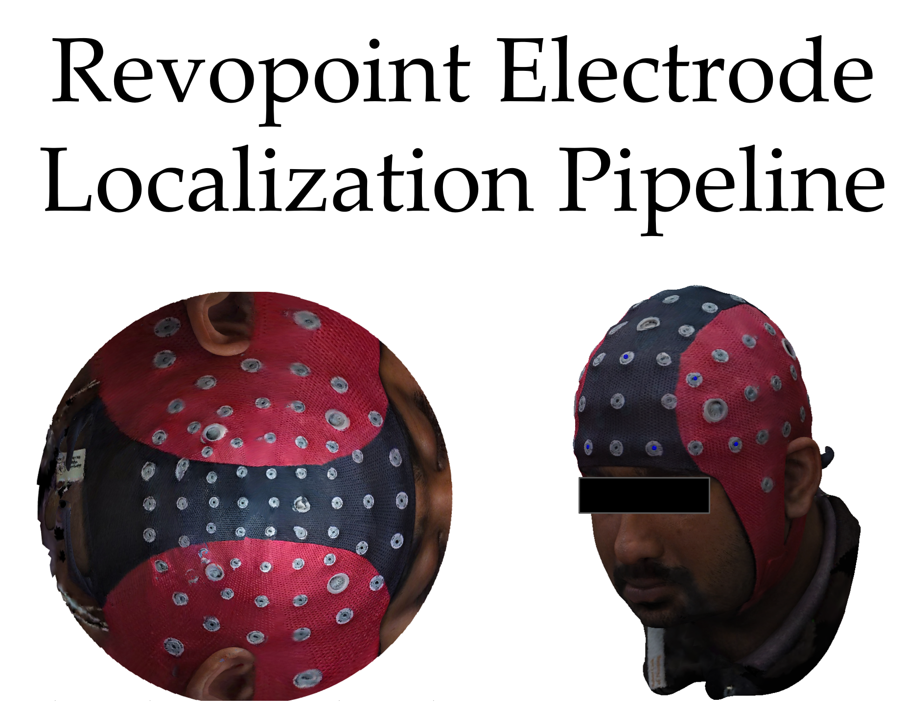

# 3Dscanner2Brainstorm
Contains routines to bring 3d scanner information into brainstorm.
The main live script: Revopoint_to_Brainstorm__EEG_Localization_Procedure

## Description
Given the output of a Revopoint structured-light 3D scan, this procedure outlines the steps in localizing the EEG channels, HPI coils, fiducials, and extra head points and then importing this channel information and the rendered head surface mesh into Brainstorm.

The two localization procedures we are using with the Revopoint scan are FieldTrip's "3D rendered mesh localization procedure" and a "2D projection surface of the mesh" localization procedure. The steps for each are as follows:
## FieldTrip 3D Rendered Mesh Localization Procedure
1. Read the OBJ file for the surface mesh.
2. Convert the units of the mesh.
3. Localize the fiducials of the head surface.
4. Realign the mesh on the bases of the fiducials to CTF coordinates.
5. Localize the electrode locations on a 3D rendered mesh. (Optionally: Localize the HPI coils on a 3D rendered mesh.)
6. Convert the head surface and electrode location structure into Brainstorm compatible MATLAB structures.
7. Derive the fiducial positions relative to the CTF coordinate system.
8. Add fiducials into the electrode location Brainstorm MATLAB structure. (Optionally: Add HPI coils into the electrode location Brainstorm MATLAB structure.)
9. Save the Brainstorm structures in a local folder.
10. Import the Brainstorm structures into Brainstorm.

## 2D Projection Localization Procedure
1. Read the OBJ file for the surface mesh.
2. Convert the units of the mesh.
3. Localize the fiducials of the head surface.
4. Realign the mesh on the bases of the fiducials to CTF coordinates.
5. Localize the electrode locations on a 2D projected surface of the mesh. (Optionally: Localize the HPI coils on a 2D projected surface of the mesh.)
6. Convert the head surface and electrode location structure into Brainstorm compatible MATLAB structures.
7. Derive the fiducial positions relative to the CTF coordinate system.
8. Add fiducials into the electrode location Brainstorm MATLAB structure. (Optionally: Add HPI coils into the electrode location Brainstorm MATLAB structure.)
9. Save the Brainstorm structures in a local folder.
9. Import the Brainstorm structures into Brainstorm.

## Directory Folders
1. cap_specifications: Folder of '.mat' files containing labels for caps of size 32 [EEG Cap 32 channels based on CA-065 identical CW-0434, 10/20 (Code: CW-3484)], 64 [EEG cap, 64 ch, identical to CW-0435, 10/10 (Code: CW-3485)], 128 [waveguard original cap, 128 channels with 5 HPI coil openings, 10/5, unshielded, Redel connector], 256 [EEG dry cap, 256 channels, shielded, equidistant, Tyco68 (Code: CY-281.s1)].
2. eeg_cap_documentation: PDF documents outlining the template cap layouts for caps of sizes 32, 64, 128, and 256.
3. generated_structures: Folder where the resulting Brainstorm output structures (from running the procedure) will be stored as '.mat' files.
4. channel_layouts: Folder of PNG image files containing the template cap layout for caps of sizes 32, 64, and 128.

## Software dependencies
1. FieldTrip Toolbox: Download FieldTrip Toolbox for MATLAB
2. Brainstorm: Download Brainstorm for MATLAB

## Demo Script Note
Intermediate resulting structures for each of the steps are stored in the file path './generated_structures/demo_structures'.